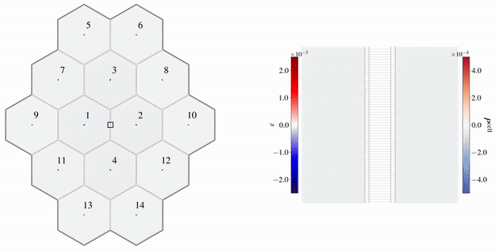

# ACAM: an **A**pposed-**C**ortex **A**dhesion **M**odel of an epithelial tissue.



<hr/>

[](https://appcom.readthedocs.io/en/latest/)

The `AppCoM` library is an implementation of a mechanical model of an active epithelial tissue.  

## Overview

### The apposed-cortex model

#### How is the cell cortex represented?

Each cell cortex in ACAM is represented as an active, continuum morphoelastic rod with resistance to bending and extension.  By explicitly considering both cortices along bicellular junctions, the model is able to replicate important cell behaviours that are not captured in many existing models e.g. cell-cell shearing and material flow around cell vertices.

#### How are adhesions represented?

Adhesions are modelled as simple springs, explicitly coupling neighbouring cell cortices.  Adhesion molecules are given a characteristic timescale, representing the average time between binding and unbinding, which modules tissue dynamics.


### Demo: loading and viewing a tissue

```python
import matplotlib.pyplot as plt

# Load a stored tissue, with 14 cells
with open('pickled_tissues/14_cells', 'rb') as new_tissue:
        eptm = dill.load(new_tissue)

# Pass the adhesion data to the cells
eptm.update_adhesion_points_between_all_cortices()
# Add some prestress to the junction shared by cells A and B
prestrech_magnitude = 1 - 0.01
eptm.apply_prestretch_to_cell_identity_pairs(prestrech_magnitude, [['A','B']])

# View in matplotlib
fig, ax = plt.subplots(figsize=(11, 9))
eptm.plot_self(ax=ax, plot_stress=True, plot_tension=True)
plt.show()
```

### Documentation

* The documentation is browsable online [here](https://appcom.readthedocs.io/en/latest/)

### Authors

* Guy Blanchard - University of Cambridge
* Jocelyn Étienne - Université Grenoble Alpes
* Alexander Fletcher - University of Sheffield
* Nathan Hervieux - University of Cambridge
* Alexander Nestor-Bergmann (maintainer) - University of Cambridge
* Bénédicte Sanson - University of Cambridge

## Dependencies

- Python 3.x
- dill
- joblib
- matplotlib
- more-itertools
- numpy
- scikit-learn
- scipy
- Shapely
